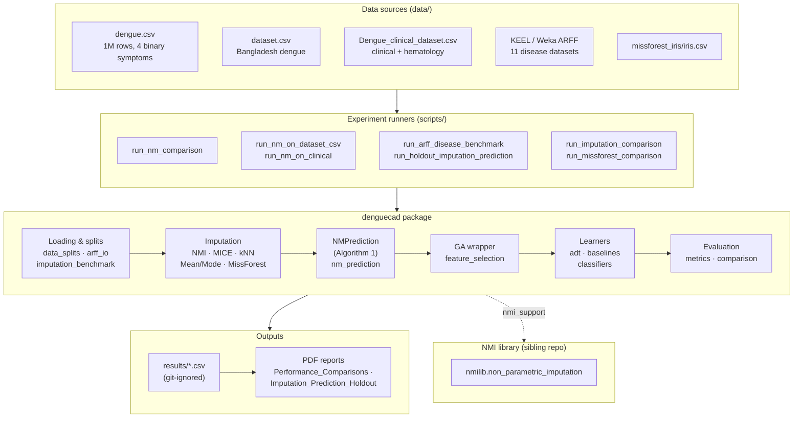
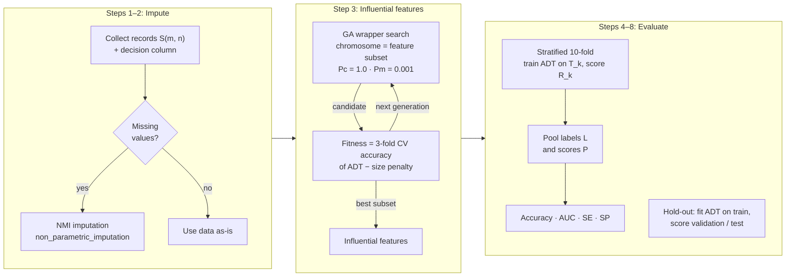
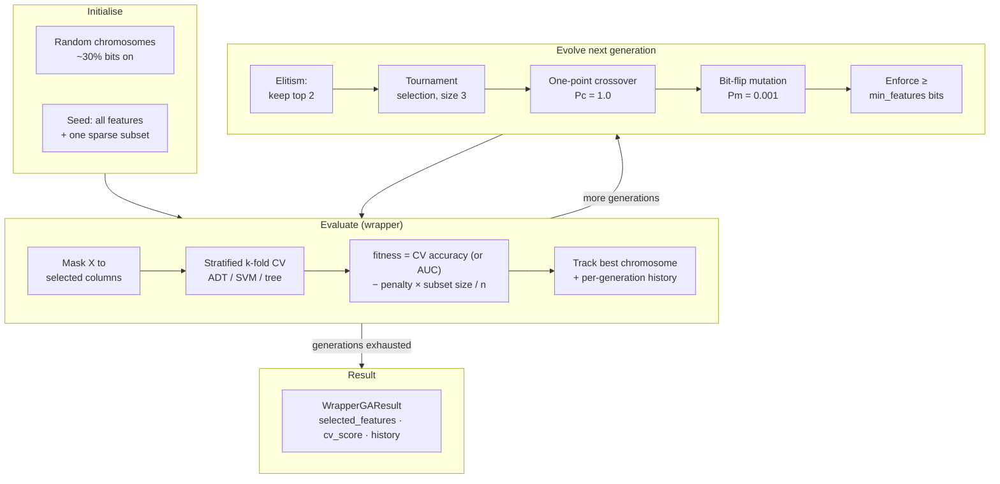
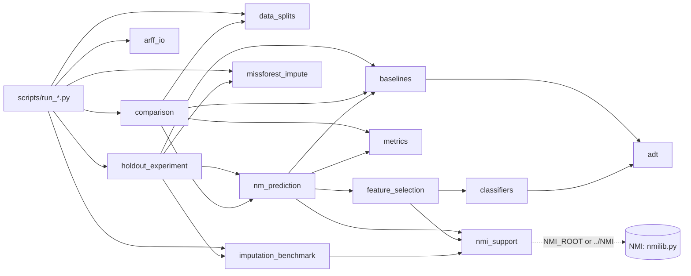
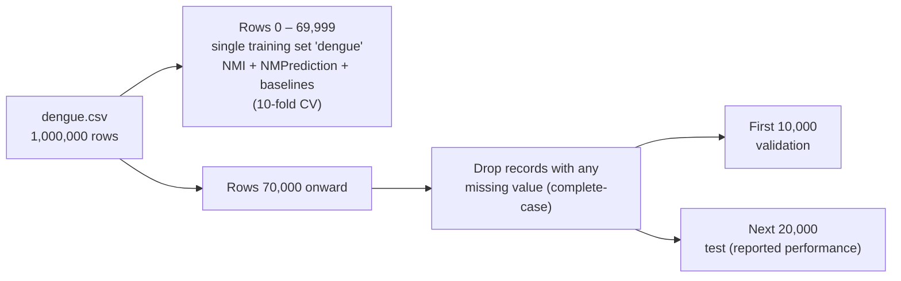
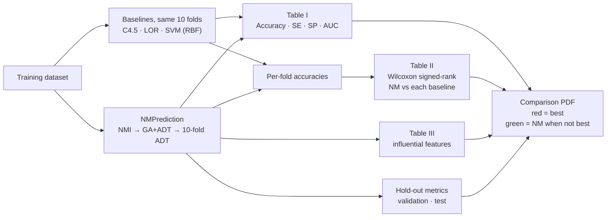
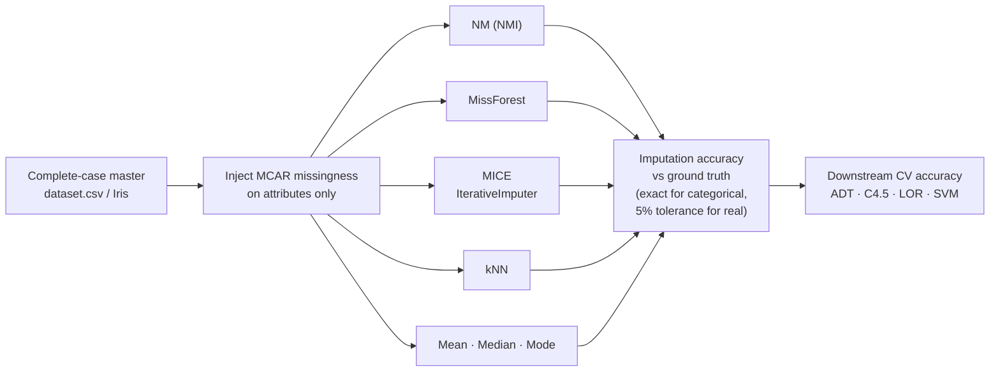
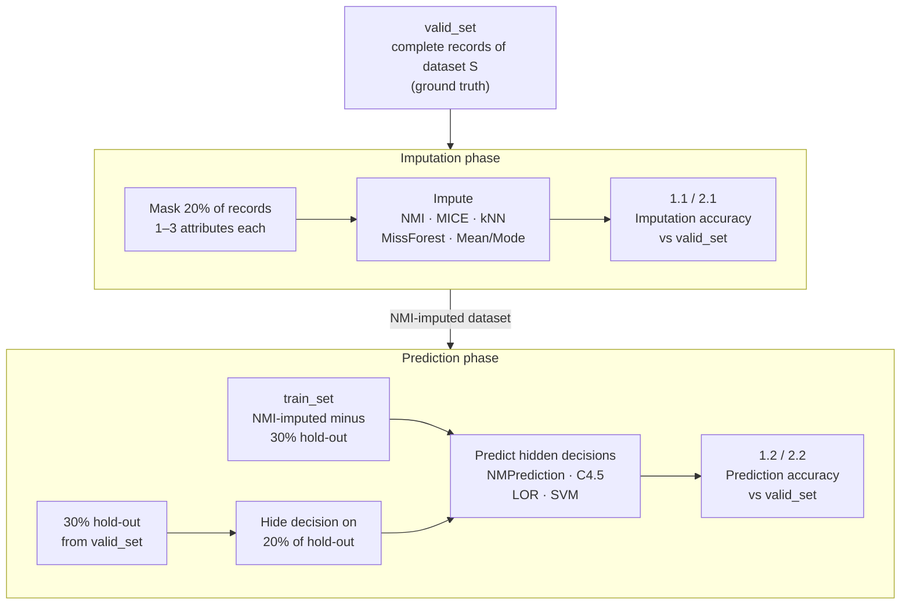
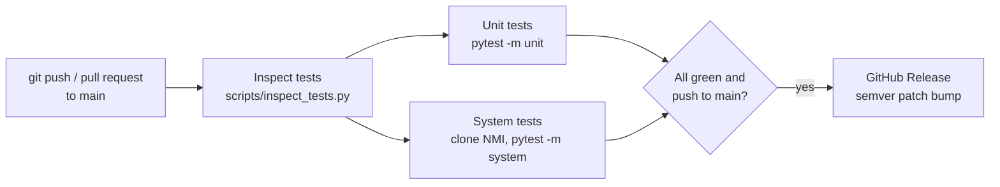

# DengueCAD Architecture

DengueCAD is a computer-aided diagnosis (CAD) stack built on the sibling **NMI** imputation library. It implements the IEEE TITB 2012 **NMPrediction** method (Algorithm 1): missing-value imputation → GA wrapper feature selection → stratified *k*-fold Alternating Decision Tree (ADT) → Accuracy / AUC / SE / SP. The core library is disease-agnostic; dengue is the primary use case, and the same pipeline runs on multi-disease ARFF benchmarks.

Rendered images of every diagram are in [`architecture/`](architecture/) and the slide deck is [`DengueCAD_Architecture_Slides.pptx`](DengueCAD_Architecture_Slides.pptx) ([PDF](DengueCAD_Architecture_Slides.pdf)). The Mermaid blocks below are the source of truth; regenerate images and slides with:

```bash
.venv/bin/python scripts/render_architecture_diagrams.py
.venv/bin/python scripts/build_architecture_slides.py --pdf
```

## 1. System overview

<!-- diagram: 01-system-overview -->


## 2. NMPrediction pipeline (Algorithm 1)

<!-- diagram: 02-nmprediction-pipeline -->


## 3. GA wrapper feature selection (Section C)

The wrapper follows Kohavi & John: the classifier itself scores each candidate subset.

<!-- diagram: 03-ga-wrapper -->


## 4. Module dependencies

Arrows point from a module to the modules it imports.

<!-- diagram: 04-module-dependencies -->


| Module | Responsibility |
|--------|----------------|
| `nm_prediction.py` | `NMPrediction`: Algorithm 1 end to end, plus hold-out evaluation |
| `feature_selection.py` | GA wrapper (`select_influential_features`, `GAWrapperConfig`) |
| `adt.py` | Alternating Decision Tree (AdaBoost over decision stumps) |
| `baselines.py` | C4.5 (entropy decision tree), SVM (RBF), LOR (logistic regression), ADT factory |
| `classifiers.py` | Classifier factory used inside the GA wrapper |
| `metrics.py` | Accuracy, AUC, sensitivity (SE), specificity (SP) |
| `comparison.py` | NM vs baselines: Table I (performance), Table II (Wilcoxon), Table III (features) |
| `data_splits.py` | `dengue.csv` protocol: 70k train, 10k validation, 20k test |
| `imputation_benchmark.py` | CSV loading/encoding, MCAR masking, NMI / MICE / kNN / Mean-Mode imputers |
| `missforest_impute.py` | Random-forest iterative imputation (MissForest) |
| `holdout_experiment.py` | valid_set / imputed train_set / hidden-decision protocol; imputation and prediction accuracy |
| `arff_io.py` | ARFF loader tolerant of KEEL `NUMERIC [min, max]` ranges |
| `nmi_support.py` | Locates and imports `nmilib` from the NMI checkout |

## 5. Data protocol for `dengue.csv`

<!-- diagram: 05-dengue-data-protocol -->


The other datasets are evaluated with stratified 10-fold CV on the full file, after NMI imputation where values are missing.

## 6. NM vs baselines evaluation

<!-- diagram: 06-evaluation-flow -->


## 7. Imputation benchmark

<!-- diagram: 07-imputation-benchmark -->


## 8. Imputation + prediction hold-out experiment

Runs on five dengue datasets and eleven disease ARFFs, repeated with different seeds (`holdout_experiment.py`, report `DengueCAD_Imputation_Prediction_Holdout.pdf`).

<!-- diagram: 09-holdout-protocol -->


## 9. Experiment runners and outputs

| Script | Dataset | Output (under `results/`) |
|--------|---------|---------------------------|
| `run_nm_comparison.py` | `dengue.csv` (70k / 10k / 20k) | `table1_performance.csv`, `table2_wilcoxon.csv`, `table3_influential_features.csv`, `holdout_metrics.csv`, `split_summary.csv` |
| `run_nm_on_dataset_csv.py` | `dataset.csv` | `nmprediction_dataset_csv/` |
| `run_nm_on_clinical.py` | `Dengue_clinical_dataset.csv` | `nmprediction_clinical/` |
| `run_arff_disease_benchmark.py` | 11 disease ARFFs | `arff_disease_comparison/` |
| `run_imputation_comparison.py` | `dataset.csv` + MCAR | `imputation_dataset_csv/` |
| `run_missforest_comparison.py` | Iris + 20% MCAR | `missforest_comparison/` |
| `run_holdout_imputation_prediction.py` | 5 dengue sets + 11 ARFFs (20% records masked, 30% hold-out, 20% hidden decisions) | `holdout_imputation_prediction/{dengue,multi}/` |
| `build_comparison_pdf.py` | all of the above | `docs/DengueCAD_Performance_Comparisons.pdf` |
| `build_holdout_comparison_pdf.py` | hold-out results | `docs/DengueCAD_Imputation_Prediction_Holdout.pdf` |

## 10. CI/CD

<!-- diagram: 08-ci-cd -->


Run the same gates locally before pushing with `bash scripts/ci_local.sh`. Details: [`TESTING.md`](TESTING.md).
