# Methods guide flowcharts

Mermaid sources for the flowcharts in `docs/DengueCAD_Methods_Guide.pdf`.
Render with:

```bash
python scripts/render_architecture_diagrams.py --source docs/methods/FLOWCHARTS.md --outdir docs/methods
```

Layout note: each chart is a vertical stack of horizontal rows (subgraphs with
`direction LR` linked subgraph-to-subgraph) so it fits an A4 page at a readable
size. Mermaid ignores a subgraph's direction when an edge links one of its
nodes to the outside, so loops stay inside a row.

## Where the methods fit

<!-- diagram: m00-overview -->
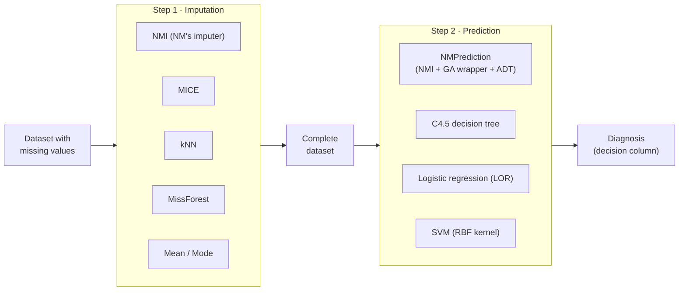

## NMI — New Method Imputation

<!-- diagram: m01-nmi -->
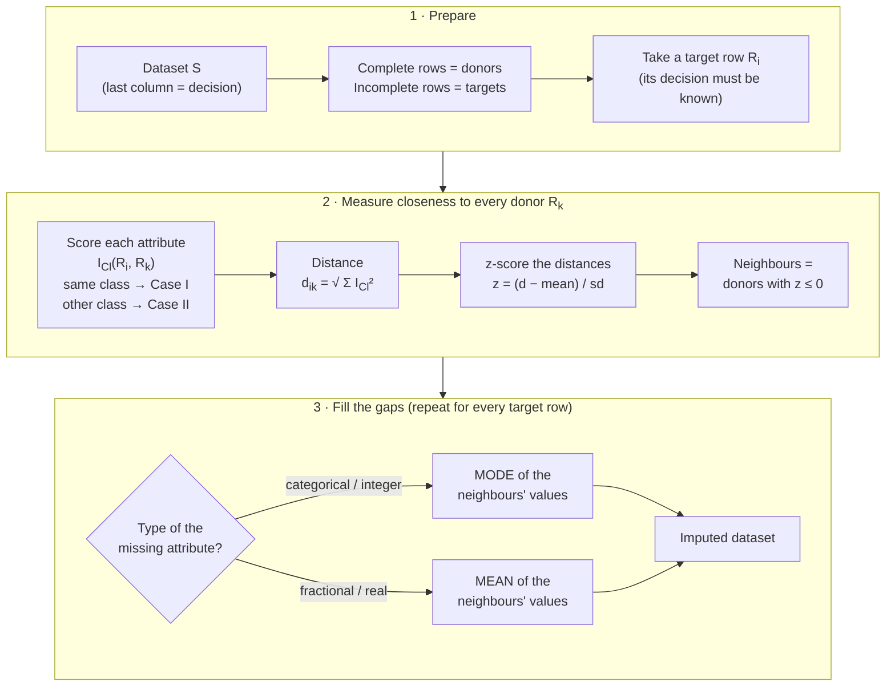

## MICE — Multivariate Imputation by Chained Equations

<!-- diagram: m02-mice -->
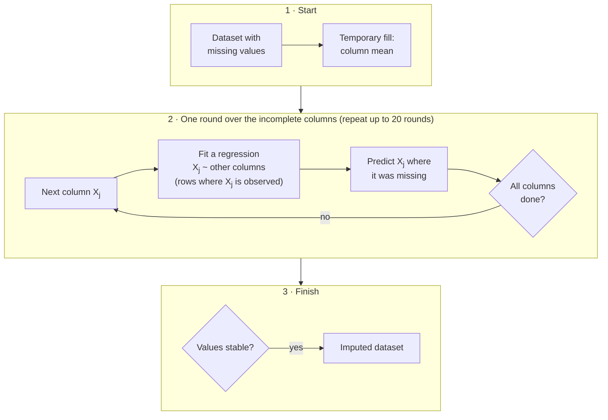

## kNN imputation

<!-- diagram: m03-knn -->
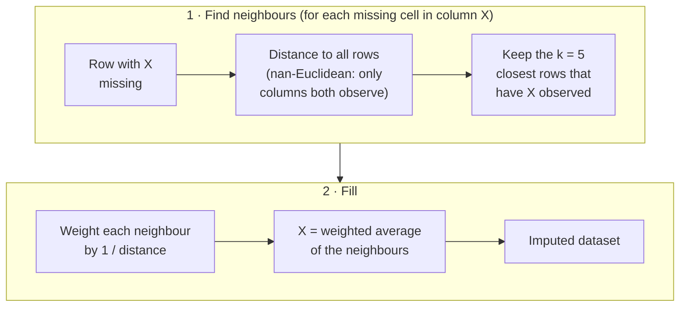

## MissForest

<!-- diagram: m04-missforest -->
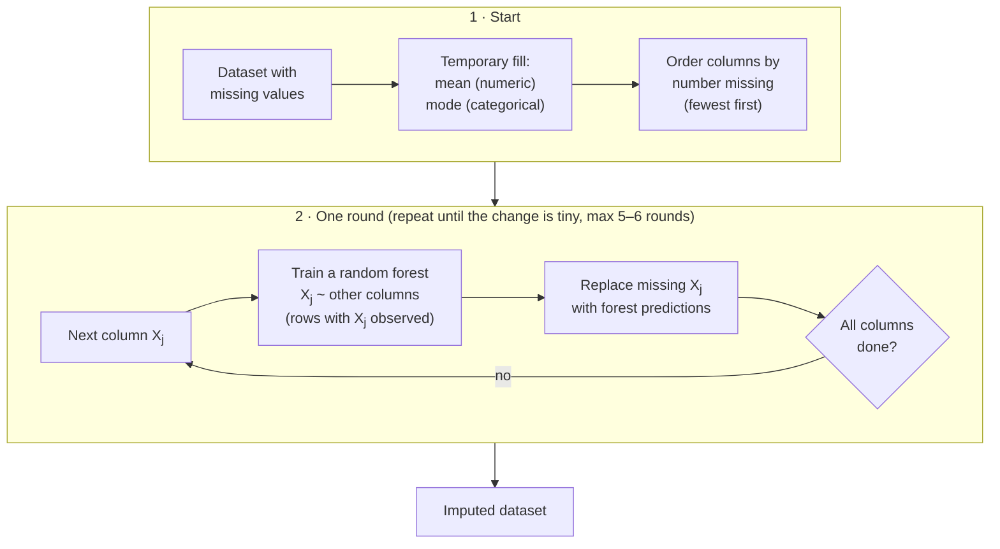

## Mean / Median / Mode imputation

<!-- diagram: m05-mean-mode -->
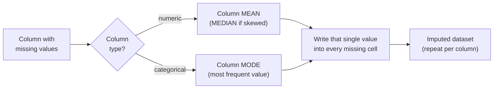

## NMPrediction (Algorithm 1)

<!-- diagram: m06-nmprediction -->
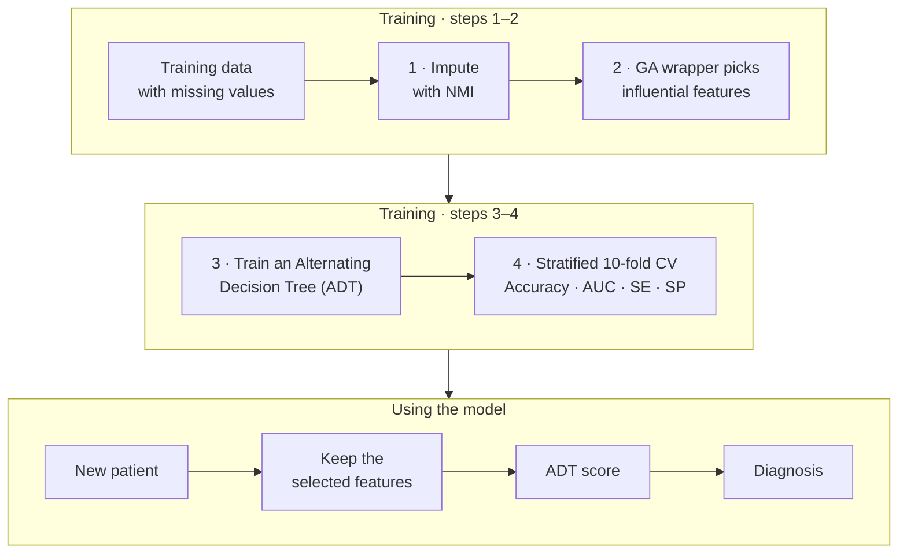

## GA wrapper feature selection

<!-- diagram: m07-ga-wrapper -->
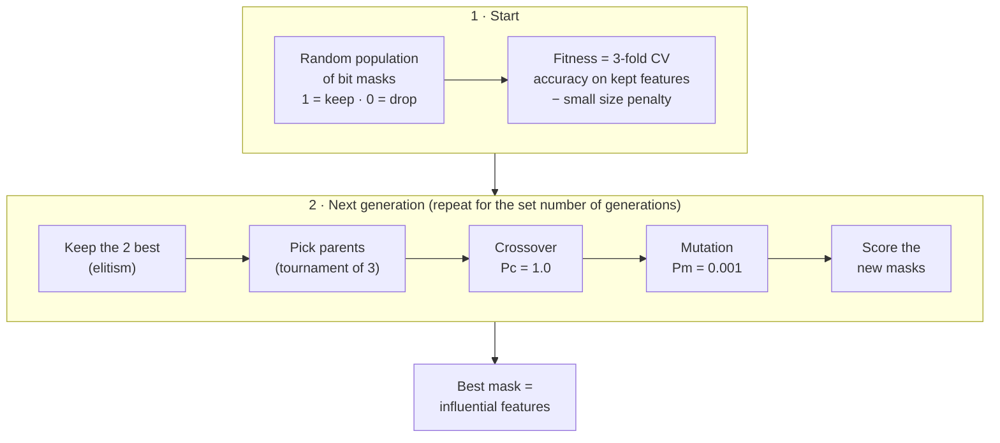

## Alternating Decision Tree (ADT)

<!-- diagram: m08-adt -->
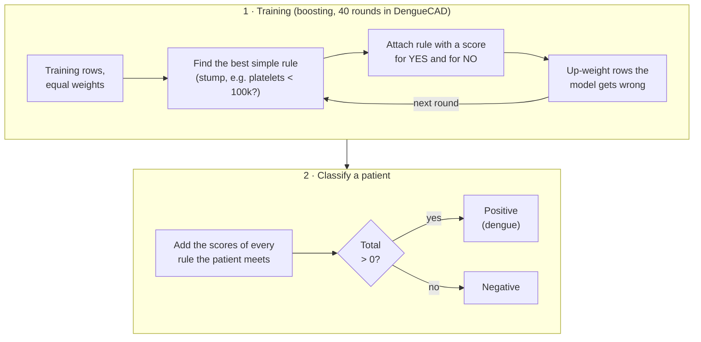

## C4.5 decision tree

<!-- diagram: m09-c45 -->
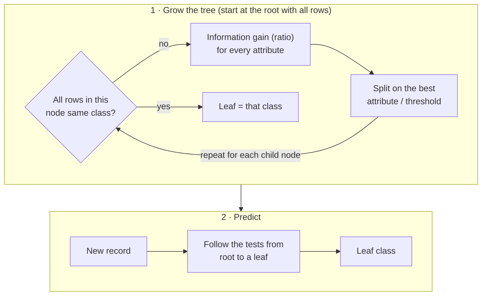

## Logistic regression (LOR)

<!-- diagram: m10-lor -->
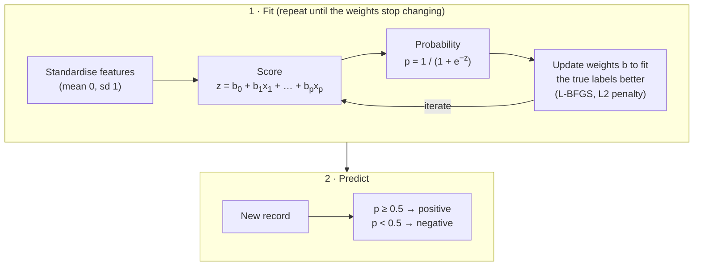

## Support Vector Machine (SVM, RBF kernel)

<!-- diagram: m11-svm -->
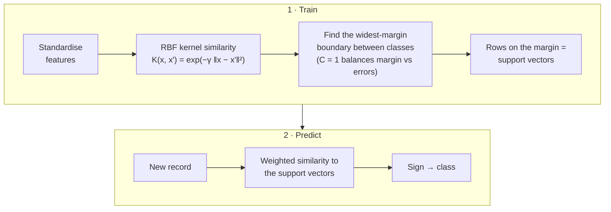
